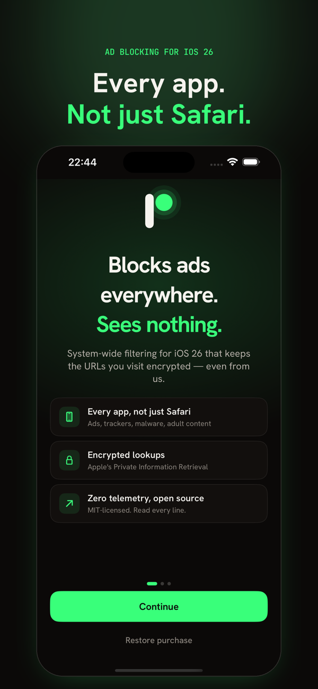
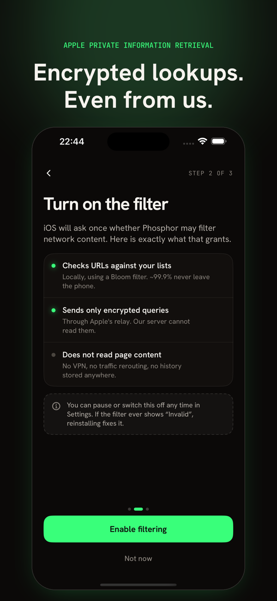
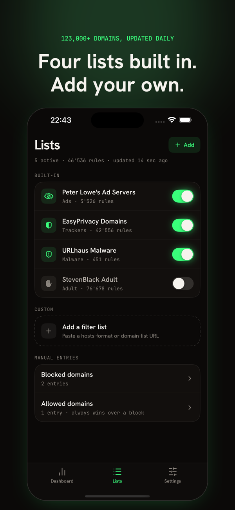
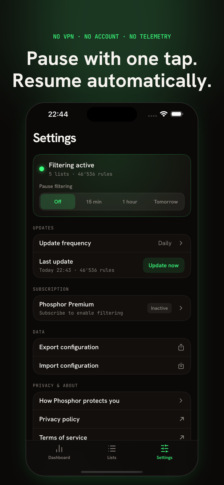

# Phosphor

  

**Privacy-preserving, system-wide URL filtering for iOS 26 — powered by Apple's `NEURLFilterManager` API.**

Phosphor blocks ads, trackers, malware, and adult content across Safari, in-app browsers, and URLSession-based apps. It uses Apple's Private Information Retrieval (PIR) with homomorphic encryption so **the app never sees the URLs you visit**.

<p align="center">
  
  
  
  
</p>

## Status

Phosphor is **not on the App Store yet**. Version 1.0 is in TestFlight and is waiting
for Apple to finish onboarding its URL filter configuration onto the Oblivious HTTP
relay; App Store and TestFlight builds can only reach the PIR server through that
relay. The app will be submitted for review once filtering works on a TestFlight build.
Development builds talk to the server directly and work today.

On the App Store it will be a subscription (7 days free, then $12.99 a year or $1.99 a
month) that pays for the PIR server. The code is MIT-licensed and you can build it yourself.

## How It Works

```
URL Request → On-Device Bloom Filter → (miss) → Allow immediately
                                     → (hit)  → Encrypted PIR query
                                                 via Apple OHTTP Relay
                                               → Block or Allow
```

1. **Bloom filter (on-device):** A compact bit array instantly checks if a URL *might* be blocked. Most URLs are cleared here with zero network traffic.
2. **PIR query (encrypted):** For Bloom filter matches, the system sends a homomorphically encrypted query to the PIR server. The server processes the query *without decrypting it*.
3. **OHTTP relay (anonymous):** Queries route through Apple's Oblivious HTTP relay. Your IP is hidden from the PIR server; query content is hidden from Apple. Neither party sees both.
4. **Result:** The encrypted response is decrypted on-device. The app never learns which URL was checked.

## Features

- **5 built-in filter lists** — Ads (Peter Lowe, StevenBlack hosts), Trackers (EasyPrivacy), Malware (URLhaus), Adult Content (StevenBlack) — 159K+ domains
- **Custom lists** — Add any remote hosts-format or domain list URL
- **Manual entries** — Block or allow individual URLs/domains
- **Dashboard** — Filter status, active lists and rules loaded. iOS does not tell apps which URLs it blocked, so there are no per-block statistics
- **Pause filtering** — 15 minutes, 1 hour, or until tomorrow
- **Export/import** — Share your configuration as JSON
- **Zero telemetry** — No analytics SDKs, no crash reporters, nothing phones home
- **Accessibility** — Full VoiceOver support, Dynamic Type up to AX5, WCAG AA contrast

## Requirements

- **iOS 26.0+** (iPhone and iPad)
- **Xcode 26+** with iOS 26 SDK
- **Apple Developer account** (organization account required per Guideline 5.4 for NetworkExtension entitlements)

## Install

### Prerequisites

```bash
# Install XcodeGen (generates .xcodeproj from project.yml)
brew install xcodegen
```

### Build

```bash
git clone https://github.com/yourname/Phosphor.git
cd Phosphor

# Generate the Xcode project
xcodegen generate

# Open in Xcode
open Phosphor.xcodeproj
```

### Entitlements Setup

Before building on a device, you need:

1. **Network Extension entitlement** — Request `com.apple.developer.networking.networkextension` with the `url-filter-provider` value from your Apple Developer account
2. **App Groups** — Enable App Groups with identifier `group.com.example.phosphor` (update `PhosphorShared/Constants.swift` with your real identifier)
3. **Bundle identifiers** — Update `project.yml` with your real bundle ID prefix and team ID

> **Note:** NetworkExtension entitlements require an **organization** Apple Developer account, not an individual one. Simulator support for NetworkExtension is limited — test on a real device.

### Secrets

Secrets are kept out of the repository. Copy the example files and fill in your own values:

```bash
cp Config/Secrets.example.xcconfig Config/Secrets.xcconfig
cp PIRServer/data/server-config.example.json PIRServer/data/server-config.json
```

`PIR_AUTH_TOKEN` in `Secrets.xcconfig` must match a token listed in your PIR server config. The token must be valid base64, for example 64 hex characters from `openssl rand -hex 32`; iOS silently ignores a token it cannot decode and the filter never starts. Re-run `xcodegen generate` after creating the file. Without it the app still builds, but it won't enable the filter.

### PIR Server

The `NEURLFilterManager` API requires a PIR server for full URL verification. See [`PIRServer/README.md`](PIRServer/README.md) for setup instructions using Apple's reference implementation.

For development, the Bloom filter prefilter still works locally without a PIR server — URLs that don't match the Bloom filter are allowed instantly. Only Bloom filter matches require the PIR server for confirmation.

### Run Tests

```bash
cd PhosphorShared
swift test
```

## Project Structure

```
Phosphor/
├── project.yml                     # XcodeGen project definition
├── Phosphor/                       # Main app target (SwiftUI)
│   ├── PhosphorApp.swift           # Entry point, onboarding gate, bundled list import
│   ├── ContentView.swift           # TabView: Dashboard / Lists / Settings
│   ├── FilterManagerService.swift  # NEURLFilterManager wrapper
│   ├── ViewModels/                 # Observable models
│   ├── Views/                      # SwiftUI views
│   ├── Theme/                      # Colors, materials, animation constants
│   └── Resources/                  # Assets, string catalog, bundled filter lists
├── PhosphorFilterExtension/        # Network Extension target
│   └── FilterControlProvider.swift # NEURLFilterControlProvider — Bloom filter serving
├── PhosphorShared/                 # Local Swift package (shared by app + extension)
│   ├── BloomFilter.swift           # FNV-1a + MurmurHash3 double hashing
│   ├── FilterListStore.swift       # JSON persistence to App Group container
│   ├── BundledListLoader.swift     # First-launch list import
│   └── ...                         # Models: FilterList, FilterRule, FilterCategory, BlockStats
├── PIRServer/                      # Server component documentation
└── Tools/                          # Download script for filter lists
```

## Comparison

| Feature | Phosphor | NextDNS | AdGuard Pro | Lockdown Privacy | 1.1.1.1 + WARP |
|---------|----------|---------|-------------|------------------|-----------------|
| System-wide filtering | Yes | Yes (DNS) | Yes (DNS/VPN) | Yes (VPN) | Partial (DNS) |
| No VPN required | **Yes** | No* | No | No | No |
| Privacy model | PIR + HE | Trust DNS | Trust VPN | On-device | Trust Cloudflare |
| App sees your URLs | **Never** | Yes (DNS) | Yes (VPN) | No | Yes (DNS) |
| Open source | **Yes** | No | Partial | Yes | No |
| Custom filter lists | Yes | Yes | Yes | Limited | No |
| iOS 26 native API | **Yes** | No | No | No | No |
| Price | $12.99/yr, 7 days free (App Store); free to build yourself† | Freemium | Paid | Free | Freemium |

*NextDNS can use DNS-over-HTTPS without a VPN profile, but this doesn't cover all app traffic.

†Building it yourself needs your own PIR server (see below) and an Apple developer account that can use the URL filter entitlement.

## Architecture

See [ARCHITECTURE.md](ARCHITECTURE.md) for a detailed explanation of how `NEURLFilterManager`, PIR, Bloom filters, and OHTTP work together.

## Security

See [SECURITY.md](SECURITY.md) for the threat model and vulnerability disclosure policy.

## License

The source code is licensed under the [MIT License](LICENSE) — free to use, modify, and distribute.

> **Note:** The Phosphor name, logo, and branding are proprietary and may not be used without permission. You are free to fork and modify the code, but please use your own name and branding for derivative works.
